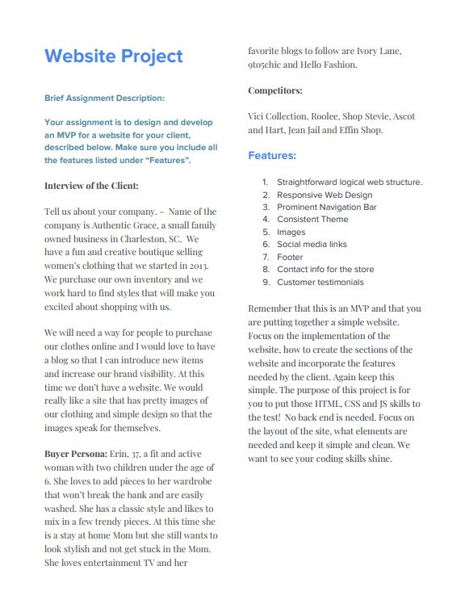
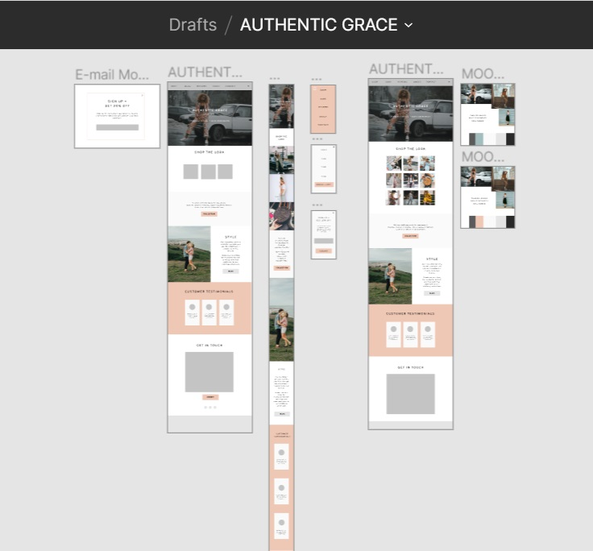

# Authentic Grace

Authentic Grace is a fictional store in South Carolina.  The website is an original creation for this store by the authors in response to an assignment.  

## Description

This project was a joint effort produced in response to an assignment for Moms Can Code School, Cohort 4.  The timeframe allotted for this project was two weeks.  This was enough time for the authors, who are relatively new to coding, to put together a functioning, responsive website, but not enough time to make everything look and work perfectly. See a later section for information about our plans for future improvements.

The assignment details can be seen in the image below.  It should be noted that the client and her desired website are fictional, but realistic.

## Authors

Claire Helland (clairehelland) - Claire is a novice coder learning front-end development in the MomsCan&Co Coding program. She hopes to one day work up to being a full-stack developer, and her codind is informed by a marketing and e-commerce career. Claire hopes to one day use her skills as a force for good in the world.

Andrea Martz, M.A. (andreamartz) is a "jack of many trades" in the field of professional certification testing.  Recently, she fell in love with coding, and she is currently building her full-stack web development skills.  She is passionate about education for all people and service to marginalized and underrepresented communities.

## Understanding the Business

We felt it was important to take time to really understand the buyer persona, customer journey and business before designing the site. This helped us keep both customer goals/use and business goals in mind during the planning process so we could deliver a relevant site experience that ultimately translates into sales and ROI for for the client.

### Buyer Persona

The buyer persona was hypothetical and provided by instructors, and we used this as a starting point for designing the Authentic Grace website.

### Business Model Canvas

We completed a Business Model Canvas with the information provided for the client, Authentic Grace. Our Business Model Canvas was also informed by research of competitive retailers and the published canvas of successful major clothing retailers like Anthropologie and Zara.

### Customer Journey

Using the buyer persona, Business Model Canvas, and a customer journey exercise from Amazon's Alexa site, we mapped our customer journey. Outlining the customer journey is an important step in understanding how a customer will use your website, and in developing a site that considers how the customer thinks, their questions, goals, etc. at various points in their journey with your brand (from Awareness through Evaluation and eventually onto the Follow-up stage). Due to time constraints, we did not go on to use the customer journey to create a content map. However, had there been more time and a real client, we would have also mapped our content according to the customer journey to create and even more impactful UI. The customer journey document walks through exactly how our ideal customer would enter and utilize the Authentic Grace website and was documented using a template from LucidCharts.

## Design of Site

The design of the site was tied as closely as possible to the buyer persona and customer journey to make the shopping experience a delight for the target audience. The design was heavily influenced by the preferred blog sites that were listed for the buyer persona, as well as competitor sites, while keeping in mind current web trends and general best practices for simple, mobile-friendly sites. The site has content blocks that are assembled for easy scrolling and navigation, a hero image that encapsulates the brand, prominant navigation bar, grid of images/products to showcase relevant clothing products, and easy access to all relevant customer information. A modal prompting sign-up for an e-mail newsletter was included. There is a contact form at the end of the homepage to allow for quick and simple customer communication with the service team. Secondary links and social media are in the footer. All primary information that a customer would want or need to access immediately is available from the homepage.

A neutral color palette was chosen, which aligns with the business goals and customer persona, with just a dash of color. Two very simple mood boards with two similar color schemes were created as part of the design process (and included with wireframe/mock-up) to help guide the look and feel of the site as it was molded into the current form.

### Wireframe/Mock-up

The wireframe/mock-up includes a couple versions of the homepage, a design for a desktop and mobile e-mail module, menus, mobile layout and mood boards. Figma was used to design and create this layout, which can be seen below:  The wireframe developed into a more complete mock-up as the design process progressed, as part of the creative process, since images and products were supposed to be a major focus of the website. Aspects of the site derived some inspiration from the content/images being utilized, while still maintaining the flexibility required for future updates. The completed MVP very closely follows the wireframe/mock-up, with minor adjustments as required by time-constraints, developer adjustments or other limitations or needs.

### Prototype

Figma was also used to create a prototype for the site, allowing us to see how the site might function via both desktop and mobile device when certain buttons and areas are clicked or otherwise activated. This was particularly helpful for the mobile menu and e-mail modal.

### Accessibility Considerations

Although not directly addressed in our wireframe and prototype, we know that every site should meet accessibility standards.  While we are not experts in accessibility and have no formal training in accessibility practices or standards, we have incorporated everything we know about accessibility into the building of this site. This includes making the site easy to read and use.

If we had additional time to research and include even greater accessibility considerations, we would love to do that in future iterations of this project.

#### Images

There are no background images on this site.  As ours is a site designed to sell clothing, we believe that all images are part of the core content of the site.  For that reason, background images - which do not provide information to search engines and do not offer alt text to describe the image - were avoided.

#### Contact Form

The contact form is easy to use and doesn't include any flashy animation.

#### Color Palette

The color palette will not overly strain eyes, avoids greens and reds that might be problematic for colorblindness, and provides enough contrast to make the site easy to read and utilize.

### Layout

The layout of the site is mobile-friendly/mobile-first, but easily translates to desktop. Individual content blocks make up each section of the site. Photos are prominant. Each block accomplishes a different goal and has a different call to action to help drive the customer foward on their journey. Blocks are simply crafted and incorporate minimalist layouts for ease of use and focus on the products.

### Color Palette

One neutral color palette was chosen from two different mood boards. Neutral grays were first chosen from palettes found online, then altered and adopted. White and a softer black were added for contrast, along with a splash of a dusty rose color. Colors were inspired and influenced by some of the images used. As mentioned before, competitors, similar brands,and blog color palettes inspired our color choices. We believe these choices are classic, timeless and create harmony on the site. They are also representative of the Authentic Grace brand.

### Typography

A simple sans-serif Google font, Overpass, was chosen to make the site readable and accessible.

## Programming Languages Used

- HTML
- CSS
- JavaScript

We wanted to focus on building a site with vanilla CSS and JavaScript (i.e., no frameworks) so that we could build and solidify our skills in those languages.

## Software Used

- Lucidchart (for the Customer Journey Map)
- Visual Studio Code

### Planning, Communication, and Sharing Resources

- Trello
- Google Drive
- Slack
- Email
- Git
- Github

### Other

- Figma (wireframe/mock-up/prototype)
- Business Model Canvas template by Alexander Osterwalder
- Amazon Alexa customer journey exercise template
- Visual Studio Code and many extensions

## Things We've Learned

We learned a lot!  Here is a bulleted list of some things that we learned:

- that Google is our best friend!
- how to identify client needs and implement them on the website
- how to use Figma to create a prototype for a webpage
- how to design a mobile-first site
- how to control various types of layout with vanilla CSS (e.g., hero image, grid of images, and navbar)
- how to use the CSS Grid and Flexbox
- how to use Git and Github when working as a team
- how Javascript can be used to change the frontend

Most importantly, we've confirmed that we have what it takes to be web developers.  Passion.  Commitment.  Problem-solving ability.

## Future Improvements

The time allotted for this project (two weeks) was tight for us, because we were learning to code while we were building this site.  We were also working on other projects simultaneously and taking in a large amount of new information as students in the Moms Can Code School program.

As a result, there are some features we did not have time to build before the due date.  There are also some bugs we did not fix yet.  We hope to have time after the MCCS program is over to improve the site in these ways.  As we think of improvements to make, we've been logging them in the Issues tab.

## Credits

Photo credits: Unsplash and Pexels